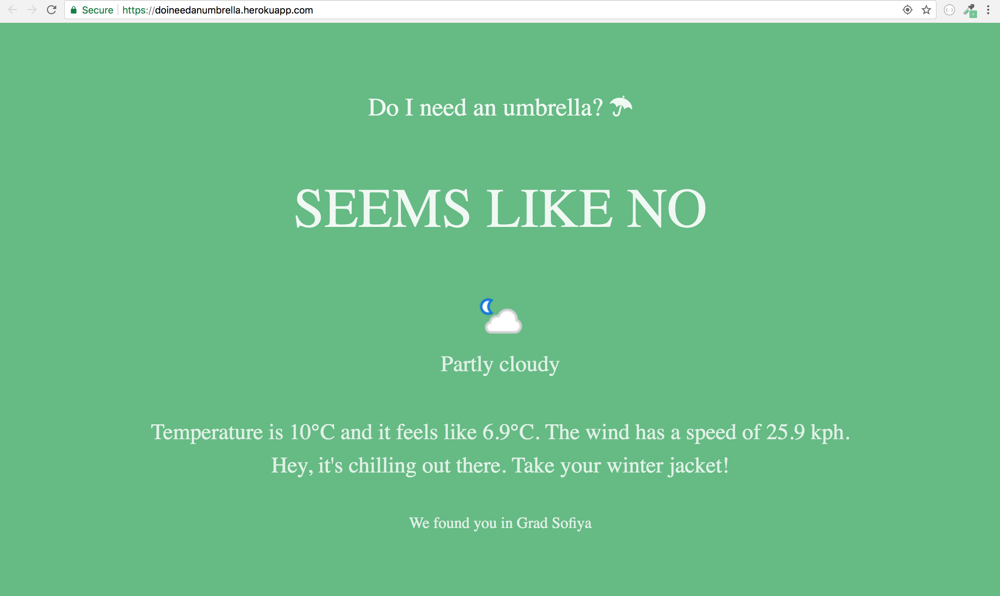

# DoINeedAnUmbrella

A simple app that tells you do you actually need an umbrella based on your location. 

[Visit heroku deploy](https://doineedanumbrella.herokuapp.com/)

It uses the react-geolocated to fetch usesr's location and the **Apixu: Weather API** to fetch the weather forecast.
